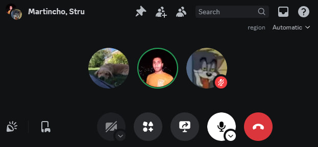
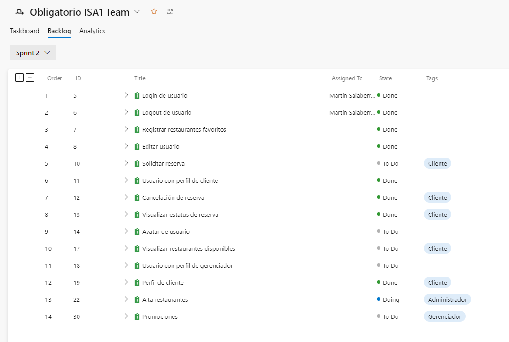
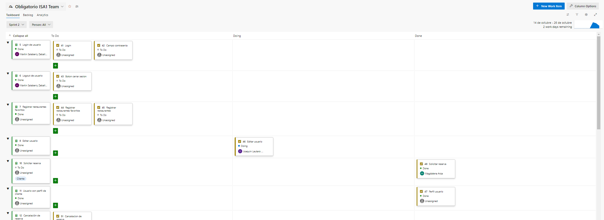
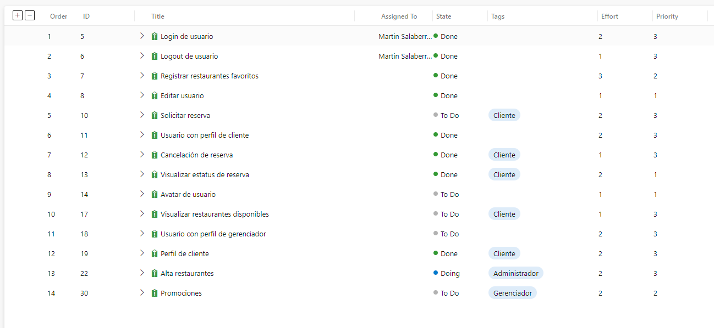
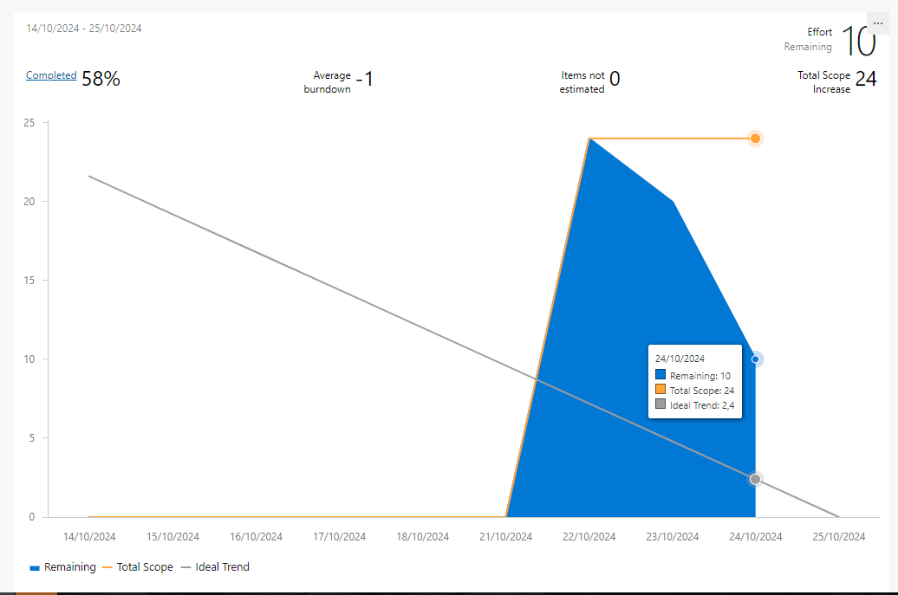
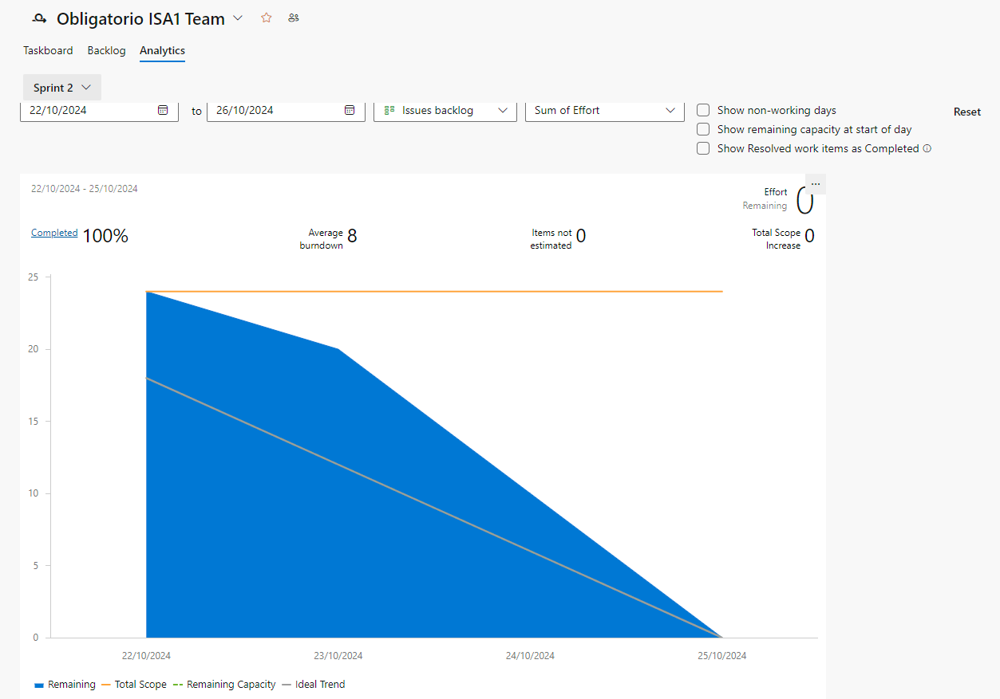
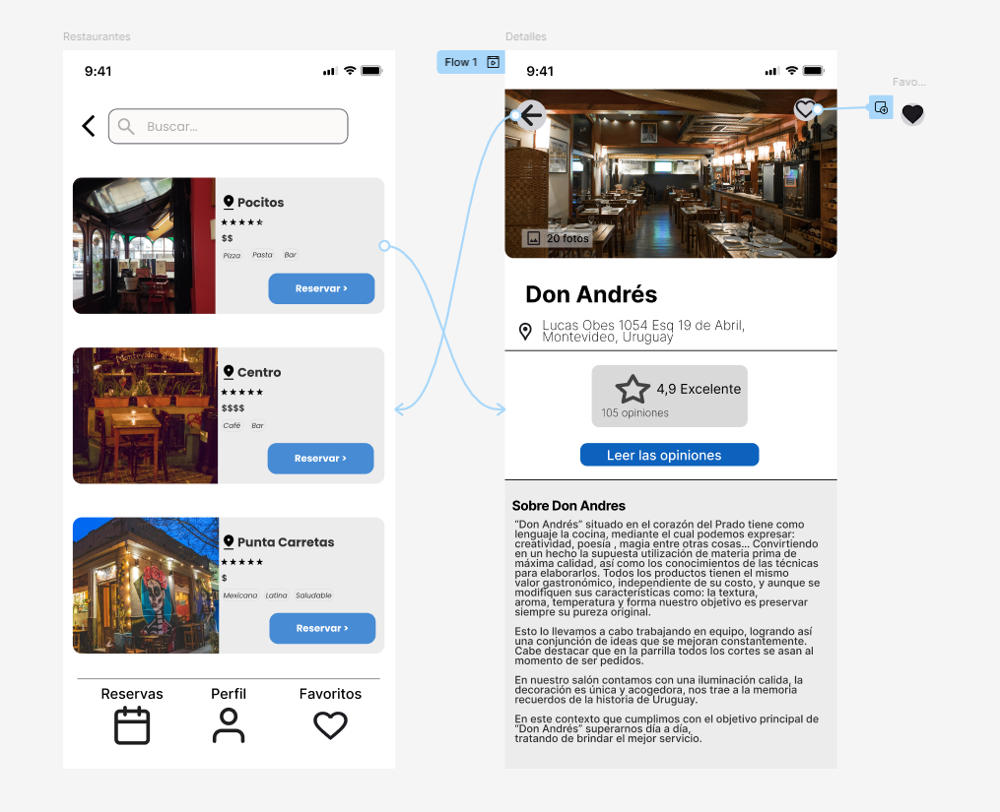

# Indice

- [Gestión de la iteración](#gestión-de-la-iteración)
  - [Definición del marco de trabajo](#definición-del-marco-de-trabajo)
  - [Planificación de la iteración](#planificación-de-la-iteración)
  - [Seguimiento de la iteración](#seguimiento-de-la-iteración)
  - [Inspección y adaptación del proceso](#inspección-y-adaptación-del-proceso)
- [Construir y validar posibles soluciones del MVP a través de prototipos](#construir-y-validar-posibles-soluciones-del-mvp-a-través-de-prototipos)
  - [Prototipos con posibles soluciones](#prototipos-con-posibles-soluciones)
  - [Inspección y adaptación del producto](#inspección-y-adaptación-del-producto)

# Gestión de la iteración

## Definición del marco de trabajo

 _[Definición del marco de trabajo SCRUM con los acuerdos principales del equipo y evidencia de sus prácticas aplicadas en la iteración. Deben estar los roles definidos para cada integrante del equipo y la justificación de la adaptación del marco de trabajo al contexto de la iteración.]_ 

### Artefactos principales

- Definición del calendario de eventos con justificación de su adaptación al contexto de la iteración.
- Roles y responsabilidades definidos para cada integrante del equipo.
- Políticas de trabajo del equipo:
  - Definition of Done.
  - Definition of Ready.

## Planificación de la iteración

_[Sprint Backlog para cumplir con el objetivo de la iteración. Debe contener las historias de usuario priorizadas y las tareas planificadas basadas en la capacidad y velocidad disponible del equipo.]_

### Artefactos principales

### Sprint planning

Se hizo una reunión en Discord para planificar la iteración 2. Se definieron las tareas a realizar en la iteración, cada integrante
eligio una tarea por la cual comenzar. Se decidió que en esta iteración se realizarán aproximadamente la mitad de las historias de usuario
medidas en puntos de historia, tomando en cuenta la prioridad de las mismas.

### Objetivos de la iteración

El objetivo de la iteración 2 es avanzar en la construcción de la aplicación, implementando las historias de usuario priorizadas en la iteración anterior.
Se espera que al final de la iteración el cliente pueda tener un prototipo funcional de la aplicación, con las funcionalidades principales implementadas.
Iniciar sesión, registrar restaurantes y crear reservas.

### Sprint backlog con historias de usuarios y tareas asociadas

El sprint backlog para la iteración 2 es el siguiente:

Se definieron las tareas a realizar:

#### Planificación de acuerdo a la capacidad del equipo

Trabajaremos con la modalidad impulsada por el compromiso, commitment-driven, como todavía no conocemos la velocidad del equipo.
En esta iteración decidimos trabajar en 14 historias de usuario que suman 24 puntos de historia.

#### Técnicas de priorización y estimación utilizadas

Para priorizar las historias de usuario las clasificamos en 3 categorías:
- Alta prioridad
- Media prioridad
- Baja prioridad

En azure las historias con prioridad alta equivalen a un 3, las de media a un 2 y las de baja a un 1.

#### Uso de métricas relevantes para la planificación como la velocidad y productividad

La velocidad del equipo que planificamos para esta iteración es de 24 puntos de historia.
La velocidad real al final de la iteración fue de [TODO] puntos de historia.

## Seguimiento de la iteración

### Artefactos principales

### Minuta de daily scrum describiendo la coordinación del trabajo de cada integrante del equipo.
  - ¿Qué logramos hacer?
  - ¿Qué planificamos hacer?
  - ¿Qué impedimentos tenemos?

Utilizamos la herramienta de azure del tablero de la iteración 2 para llevar un seguimiento de las tareas realizadas por cada integrante del equipo.

### Registro y reporte de horas de cada integrante del equipo con sus actividades principales.

Arza
- 22/10 : 1 hora
- 24/10 : 3 horas

Salaberry
- 22/10 : 1 hora
- 23/10 : 3 horas

Struyas
- 22/10 : 1 hora
- 23/10 : 2 horas
- 24/10 : 1 hora

### Seguimiento visual de la iteración con burndown y/o burnup charts

Faltando 3 días para finalizar la iteración, el burndown chart es el siguiente:

Al final de la iteración, el burndown chart es el siguiente:

Comenzando en el dia que se realizo la planificación de la iteración, el burndown chart es el siguiente:

## Inspección y adaptación del proceso

_[Existe evidencia sobre la inspección del proceso con aprendizajes principales y acciones de mejora implementadas durante el desarrollo del proyecto.]_

### Artefactos principales

- Minuta de la retrospectiva con la dinámica utilizada y sus principales resultados.
- Planificación y seguimiento de las acciones de mejora.

# Construir y validar posibles soluciones del MVP a través de prototipos

## Prototipos con posibles soluciones

_[Existen diferentes propuestas de solución para entregar valor y resolver el problema identificado implementado a través de prototipos. Los prototipos deberán ser exportados en algún formato de imagen (como png o jpg) a efectos de poder ser visualizados fácilmente dentro del propio repo de github.]_

### Artefactos principales

### Prototipos interactivos para ser navegados

Construimos prototipos de la aplicación en la página de Figma.
- [Proyecto en Figma](https://www.figma.com/design/BYvhnvacIuyWrmaI2aCwkn/Obligatorio-ISA?node-id=5-4&t=PvC4k7wwPJWg1mZg-1)

- [Prototipo de la interfaz de usuario](https://www.figma.com/proto/BYvhnvacIuyWrmaI2aCwkn/Obligatorio-ISA?node-id=165-1170&node-type=canvas&t=Rm3wx3O6vxyQp2H4-1&scaling=scale-down&content-scaling=fixed&page-id=5%3A4&starting-point-node-id=165%3A1170)

### Login

### Logout

### Registro

### Pagina principal

### Perfil de usuario

### Crear restaurante
[Prototipo de crear restaurante](https://www.figma.com/proto/BYvhnvacIuyWrmaI2aCwkn/Obligatorio-ISA?node-id=71-555&node-type=canvas&t=FBg1YP0YlTsJTXuT-1&scaling=min-zoom&content-scaling=fixed&page-id=24%3A59&starting-point-node-id=71%3A555)

[Prototipo de perfil gerenciador](https://www.figma.com/design/BYvhnvacIuyWrmaI2aCwkn/Obligatorio-ISA?node-id=136-897)

[Prototipo de solicitar reserva](https://www.figma.com/design/BYvhnvacIuyWrmaI2aCwkn/Obligatorio-ISA?node-id=24-22748)

[Prototipo de crear promociones](https://www.figma.com/design/BYvhnvacIuyWrmaI2aCwkn/Obligatorio-ISA?node-id=84-2492)

[Prototipo de marcar restaurantes como favoritos](https://www.figma.com/design/BYvhnvacIuyWrmaI2aCwkn/Obligatorio-ISA?node-id=187-2137)

- Prototipos asociados como bocetos a las historias de usuario.

## Inspección y adaptación del producto

### Feedback de usuarios
#### Perfil del Usuario
Edad: 21 años
Preferencias: Salidas frecuentes a restaurantes con amigos y familiares
#### Comentarios sobre la Interfaz de Usuario
1. Apariencia y Estética:
   La interfaz es limpia y funcional, pero podría beneficiarse de un diseño visualmente más atractivo, con colores y gráficos mas modernos, para así captar mejor al público juvenil.
   Aunque los textos son claros, la organización y el espaciado de algunos elementos, como el perfil del usuario, podrían mejorarse. Recomendación: ajustar o agrandar los márgenes y el espaciado, y explorar fuentes más modernas.
2. Usabilidad:
   La navegación es intuitiva, con íconos bastante representativos.
   La opción de registro con Google u otras plataformas es conveniente.
   La interfaz no siempre proporciona una confirmación visual al registrar cambios o indicar qué se puede hacer. Sugerencia: añadir mensajes de confirmación breves, como “Agregado a favoritos” o modificar la coloración de los botones. En el caso de modificar o crear usuarios, por ejemplo, se podría cambiar el color de los botones cuando se pueda completar la acción.
   Aunque es útil, el mapa interactivo de reservas puede ser pequeño y difícil de usar. Sugerencia: resaltar las zonas seleccionadas y hacer más visibles los filtros (tipo de comida, precio, valoraciones) para facilitar la búsqueda.
3. Funcionalidades Clave:
   El historial de reservas y restaurantes favoritos es accesible, aunque se podrían organizar en pestañas, secciones o incluso en un calendario específico.
4. Sugerencias para Implementaciones Futuras:
   Sistema de Recompensas: Agregar un sistema de puntos, recompensas o versión paga, que brinde a usuarios frecuentes descuentos o promociones exclusivas.
   Favoritos y Listas Personalizadas: Permitir la creación de listas de favoritos con categorías, como “Para citas” o “Para ir con amigos”, para facilitar el acceso.
   Filtros de Búsqueda: Incluir opciones de búsqueda avanzada como “Abierto ahora” o “Al aire libre” para una búsqueda más precisa.
   Personalización de Avatares: La selección de avatares es buena, pero una opción para personalizarlos o integrarlos desde redes sociales aumentaría la personalización, algo importante para usuarios jóvenes.
   Recuperación de Contraseña: Implementar la recuperación de contraseña con opciones populares, como SMS o correo electrónico.
   Clasificación de Notificaciones: Clasificar las notificaciones en categorías como “Confirmaciones” o “Promociones” para que el usuario pueda decidir qué tipo de notificaciones desea recibir.

### Conclusiones

#### Resultados Clave
- Prototipos con Posibles Soluciones
Actividades Realizadas: Se llevaron a cabo actividades de ideación y prototipado en Figma.
Progreso: Los prototipos iniciales en Figma abarcaron funcionalidades clave como el login de usuario, registro, creación de perfiles y el proceso de reserva de restaurantes. Figma nos permitió crear un equipo para facilitar el trabajo colaborativo.
Conclusión: Las propuestas de solución a través de los prototipos permitieron al equipo visualizar cómo las funcionalidades principales abordan las necesidades de los usuarios, estableciendo una base sólida para la validación con usuarios.

- Inspección y Adaptación del Producto
Validación con Usuarios: Se realizaron pruebas de usabilidad con un usuario objetivo para evaluar la facilidad de uso y la efectividad de la interfaz. Estas pruebas ayudaron a identificar áreas de a mejorar o modificar en nuestro proyecto.
Ajustes Finales: Varios de los comentarios de los usuarios coincidieron con funcionalidades que el equipo ya había planificado. Esto confirma que el equipo está alineado con las expectativas y necesidades del usuario.

- Siguientes Pasos
  - Sistema de Recompensas
    - Implementar un sistema de puntos para premiar a usuarios frecuentes con descuentos y promociones. Evaluar una versión paga para beneficios adicionales.

  - Listas Personalizadas de Favoritos
    - Permitir a los usuarios crear listas de favoritos con categorías personalizadas (ej. “Para citas”, “Para amigos”) para facilitar el acceso.

  - Filtros de Búsqueda Avanzada
    - Añadir filtros de búsqueda como “Abierto ahora”, “Al aire libre” y rango de precios, mejorando la precisión en la búsqueda de restaurantes.

  - Personalización de Avatares
    - Expandir la selección de avatares y permitir la carga de imágenes desde redes sociales para una experiencia más personalizada.

  - Recuperación de Contraseña
    - Incorporar opciones de recuperación mediante SMS o correo electrónico, simplificando el proceso para los usuarios.

  - Clasificación de Notificaciones
    - Organizar las notificaciones en categorías (ej. “Confirmaciones”, “Promociones”) para que el usuario pueda personalizar qué recibir.

- Conclusiones
  - La iteración 2 fue exitosa en la creación y validación de prototipos en Figma que abordan las necesidades principales de los usuarios en las que seleccionamos para trabajar. Los ajustes realizados tras la recolección de feedback nos permitiran adaptar el producto a un diseño más accesible y funcional, logrando que la aplicación se perciba como amigable, atractiva y útil. Además, el hecho de que varias de las sugerencias de los usuarios coincidieran con funcionalidades ya planificadas es una señal positiva de que el equipo está alineado con las expectativas de los usuarios. Esta iteración ha establecido una buena base para avanzar en el desarrollo del producto en las próximas fases del proyecto.

### Artefactos principales

[TODO]
- Minutas de sprint review.
- Evidencia de los usability testing con usuarios finales.
  - Descripción de las tareas propuestas a los usuarios finales.
  - Cobertura obtenida de validación de los usuarios de la aplicación.
- Feedback recibido de los usuarios finales con la priorización de las propuestas de cambio.
