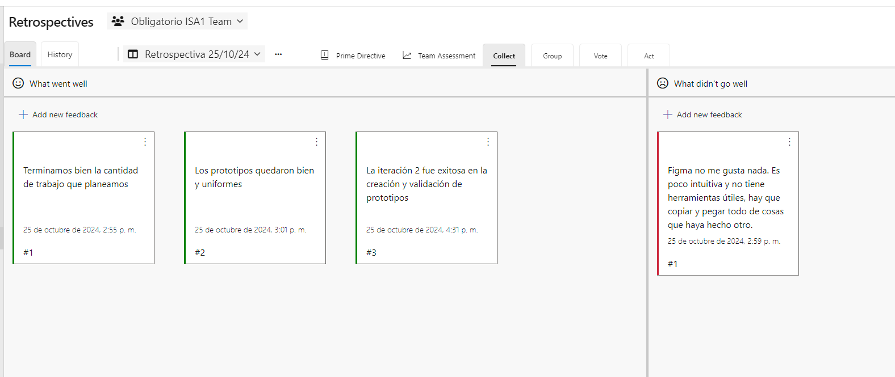
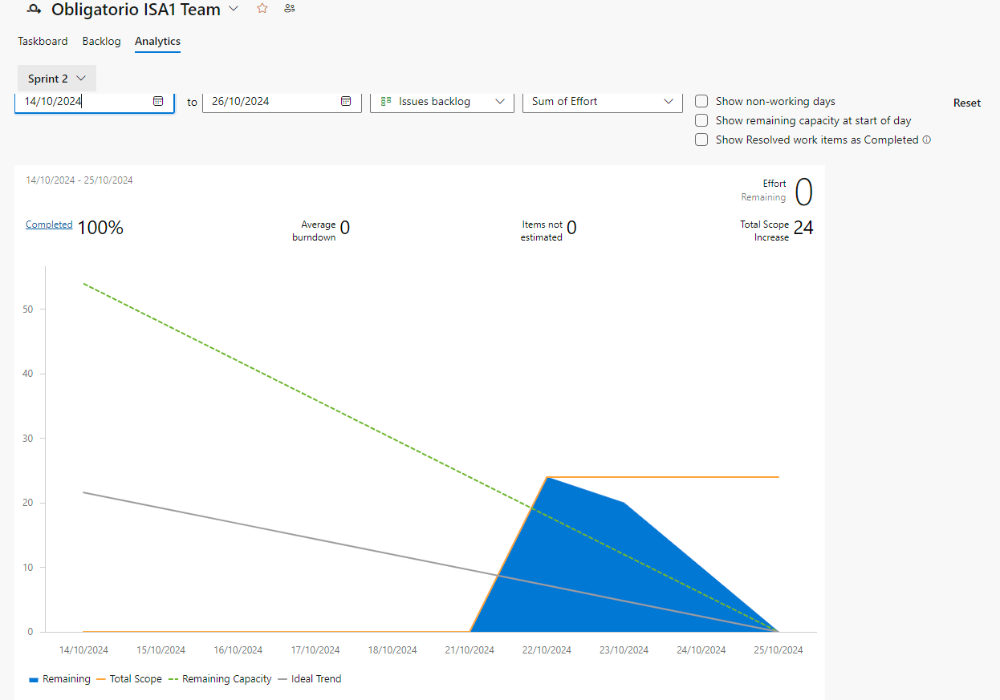
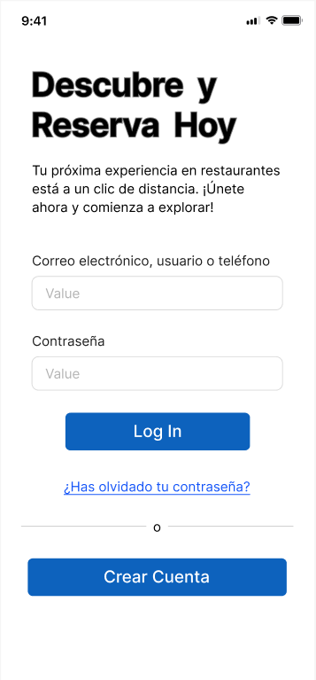
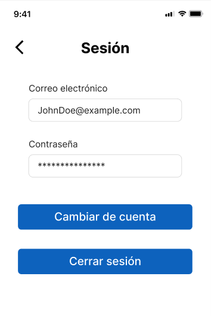
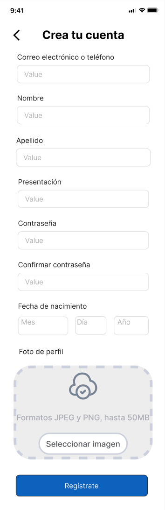
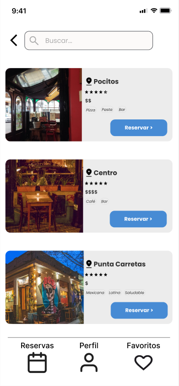
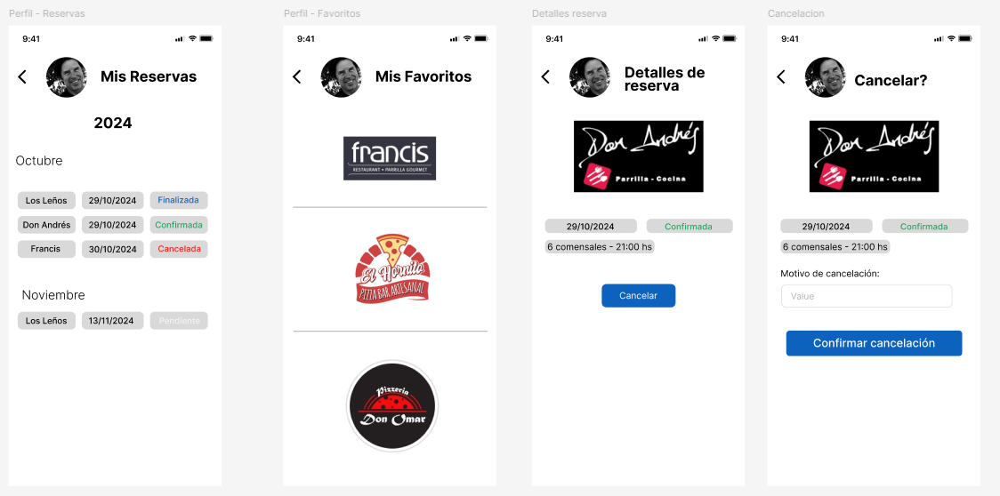
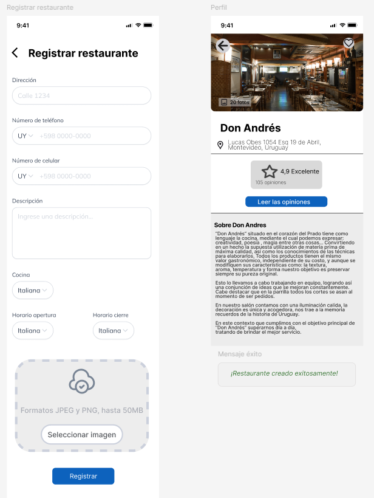
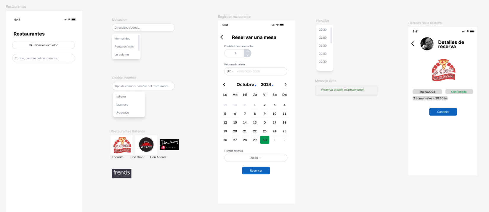

# Indice

- [Gestión de la iteración](#gestión-de-la-iteración)
  - [Definición del marco de trabajo](#definición-del-marco-de-trabajo)
  - [Planificación de la iteración](#planificación-de-la-iteración)
  - [Seguimiento de la iteración](#seguimiento-de-la-iteración)
  - [Inspección y adaptación del proceso](#inspección-y-adaptación-del-proceso)
- [Construir y validar posibles soluciones del MVP a través de prototipos](#construir-y-validar-posibles-soluciones-del-mvp-a-través-de-prototipos)
  - [Prototipos con posibles soluciones](#prototipos-con-posibles-soluciones)
  - [Inspección y adaptación del producto](#inspección-y-adaptación-del-producto)

# Gestión de la iteración

## Definición del marco de trabajo

_[Definición del marco de trabajo SCRUM con los acuerdos principales del equipo y evidencia de sus prácticas aplicadas en la iteración. Deben estar los roles definidos para cada integrante del equipo y la justificación de la adaptación del marco de trabajo al contexto de la iteración.]_

### Artefactos principales

- Definición del calendario de eventos con justificación de su adaptación al contexto de la iteración.
- Roles y responsabilidades definidos para cada integrante del equipo.
- Políticas de trabajo del equipo:
  - Definition of Done.
  - Definition of Ready.

## Planificación de la iteración

_[Sprint Backlog para cumplir con el objetivo de la iteración. Debe contener las historias de usuario priorizadas y las tareas planificadas basadas en la capacidad y velocidad disponible del equipo.]_

### _Artefactos principales_

### Sprint planning

Se hizo una reunión en Discord para planificar la iteración 2. Se definieron las tareas a realizar en la iteración, cada integrante
eligio una tarea por la cual comenzar. Se decidió que en esta iteración se realizarán aproximadamente la mitad de las historias de usuario
medidas en puntos de historia, tomando en cuenta la prioridad de las mismas.

### Objetivos de la iteración

El objetivo de la iteración 2 es avanzar en la construcción de la aplicación, implementando las historias de usuario priorizadas en la iteración anterior.
Se espera que al final de la iteración el cliente pueda tener un prototipo funcional de la aplicación, con las funcionalidades principales implementadas.
Iniciar sesión, registrar restaurantes y crear reservas.

### Sprint backlog con historias de usuarios y tareas asociadas

El sprint backlog para la iteración 2 es el siguiente:

Se definieron las tareas a realizar:

#### Planificación de acuerdo a la capacidad del equipo

Trabajaremos con la modalidad impulsada por el compromiso, commitment-driven, como todavía no conocemos la velocidad del equipo.
En esta iteración decidimos trabajar en 14 historias de usuario que suman 24 puntos de historia.

#### Técnicas de priorización y estimación utilizadas

Para priorizar las historias de usuario las clasificamos en 3 categorías:
- Alta prioridad
- Media prioridad
- Baja prioridad

En azure las historias con prioridad alta equivalen a un 3, las de media a un 2 y las de baja a un 1.

#### Uso de métricas relevantes para la planificación como la velocidad y productividad

La velocidad del equipo que planificamos para esta iteración es de 24 puntos de historia.
La velocidad real al final de la iteración fue de [TODO] puntos de historia.

## Seguimiento de la iteración

### Artefactos principales

### Minuta de daily scrum describiendo la coordinación del trabajo de cada integrante del equipo.
  - ¿Qué logramos hacer?
  - ¿Qué planificamos hacer?
  - ¿Qué impedimentos tenemos?

Utilizamos la herramienta de azure del tablero de la iteración 2 para llevar un seguimiento de las tareas realizadas por cada integrante del equipo.

### Registro y reporte de horas de cada integrante del equipo con sus actividades principales.

Arza
- 22/10 : 1 hora
- 24/10 : 3 horas

Salaberry
- 22/10 : 1 hora
- 23/10 : 3 horas

Struyas
- 22/10 : 1 hora
- 23/10 : 2 horas
- 24/10 : 1 hora

### Seguimiento visual de la iteración con burndown y/o burnup charts

Faltando 3 días para finalizar la iteración, el burndown chart es el siguiente:

Al final de la iteración, el burndown chart es el siguiente:

Comenzando en el dia que se realizo la planificación de la iteración, el burndown chart es el siguiente:

## Inspección y adaptación del proceso

_[Existe evidencia sobre la inspección del proceso con aprendizajes principales y acciones de mejora implementadas durante el desarrollo del proyecto.]_

### Artefactos principales

- Minuta de la retrospectiva con la dinámica utilizada y sus principales resultados.
- Planificación y seguimiento de las acciones de mejora.

# Construir y validar posibles soluciones del MVP a través de prototipos

## Prototipos con posibles soluciones

_[Existen diferentes propuestas de solución para entregar valor y resolver el problema identificado implementado a través de prototipos. Los prototipos deberán ser exportados en algún formato de imagen (como png o jpg) a efectos de poder ser visualizados fácilmente dentro del propio repo de github.]_

### Artefactos principales

### Prototipos interactivos para ser navegados

Construimos prototipos de la aplicación en la página de Figma.
- [Proyecto en Figma](https://www.figma.com/design/BYvhnvacIuyWrmaI2aCwkn/Obligatorio-ISA?node-id=5-4&t=PvC4k7wwPJWg1mZg-1)

- [Prototipo de la interfaz de usuario](https://www.figma.com/proto/BYvhnvacIuyWrmaI2aCwkn/Obligatorio-ISA?node-id=165-1170&node-type=canvas&t=Rm3wx3O6vxyQp2H4-1&scaling=scale-down&content-scaling=fixed&page-id=5%3A4&starting-point-node-id=165%3A1170)

### Login

### Logout

### Registro

### Pagina principal

### Perfil de usuario

### Crear restaurante
[Prototipo de crear restaurante](https://www.figma.com/proto/BYvhnvacIuyWrmaI2aCwkn/Obligatorio-ISA?node-id=71-555&node-type=canvas&t=FBg1YP0YlTsJTXuT-1&scaling=min-zoom&content-scaling=fixed&page-id=24%3A59&starting-point-node-id=71%3A555)

[Prototipo de perfil gerenciador](https://www.figma.com/design/BYvhnvacIuyWrmaI2aCwkn/Obligatorio-ISA?node-id=136-897)

[Prototipo de solicitar reserva](https://www.figma.com/design/BYvhnvacIuyWrmaI2aCwkn/Obligatorio-ISA?node-id=24-22748)

[Prototipo de crear promociones](https://www.figma.com/design/BYvhnvacIuyWrmaI2aCwkn/Obligatorio-ISA?node-id=84-2492)

[Prototipo de marcar restaurantes como favoritos](https://www.figma.com/design/BYvhnvacIuyWrmaI2aCwkn/Obligatorio-ISA?node-id=187-2137)

- Prototipos asociados como bocetos a las historias de usuario.

## Inspección y adaptación del producto

_[Existe evidencia de instancias de inspección y validación del producto con usuarios y la recolección de su feedback con ajustes finales a los prototipos.]_

### Artefactos principales

[TODO]
- Minutas de sprint review.
- Evidencia de los usability testing con usuarios finales.
  - Descripción de las tareas propuestas a los usuarios finales.
  - Cobertura obtenida de validación de los usuarios de la aplicación.
- Feedback recibido de los usuarios finales con la priorización de las propuestas de cambio.
