# Indice

- [Gestión de la iteración](#gestión-de-la-iteración)
  - [Definición del marco de trabajo](#definición-del-marco-de-trabajo)
  - [Planificación de la iteración](#planificación-de-la-iteración)
  - [Seguimiento de la iteración](#seguimiento-de-la-iteración)
  - [Inspección y adaptación del proceso](#inspección-y-adaptación-del-proceso)
- [Construir y validar posibles soluciones del MVP a través de prototipos](#construir-y-validar-posibles-soluciones-del-mvp-a-través-de-prototipos)
  - [Prototipos con posibles soluciones](#prototipos-con-posibles-soluciones)
  - [Inspección y adaptación del producto](#inspección-y-adaptación-del-producto)

# Gestión de la iteración

## Definición del marco de trabajo

**Roles y responsabilidades del equipo**
- Product Owner: Magdalena Arza
  - Prioriza el Product Backlog y asegura que el equipo trabaje en las historias de mayor valor para el proyecto.
- SCRUM Master: Martín Salaberry
  - Facilita las ceremonias SCRUM, elimina obstáculos y asegura que se respeten las buenas prácticas del marco.
- Development Team: Joaquín Struyas
  - Encargado de desarrollar las historias de usuario planificadas en cada sprint, garantizando que el incremento del producto esté listo al finalizar la iteración.

**Eventos SCRUM**
- Sprint Planning: Se realizó de manera presencial en la facultad, donde se definieron los objetivos del sprint y las tareas más prioritarias y sus story points.
- Daily Scrum: Se llevaron a cabo principalmente de manera presencial en la facultad. Sin embargo, al ser un sprint relativamente corto, no fue necesario realizar daily meetings todos los días, y en algunos casos se implementaron mediante breves llamadas a través de Discord.
- Sprint Review: Se realizó al final de cada sprint para presentar el incremento del producto a los interesados clave.
- Sprint Retrospective: Esta ceremonia se llevó a cabo para discutir mejoras en los procesos y reflexionar sobre lo que funcionó y lo que puede optimizarse en los siguientes sprints.

### Artefactos principales

- Definición del calendario de eventos con justificación de su adaptación al contexto de la iteración.
- Roles y responsabilidades definidos para cada integrante del equipo.
- Políticas de trabajo del equipo:
  - Definition of Done.
  - Definition of Ready.

## Planificación de la iteración

_[Sprint Backlog para cumplir con el objetivo de la iteración. Debe contener las historias de usuario priorizadas y las tareas planificadas basadas en la capacidad y velocidad disponible del equipo.]_

### Artefactos principales

- Minuta de la sprint planning con su agenda, actividades y resultados.
- Objetivos de la iteración.
#### Sprint backlog
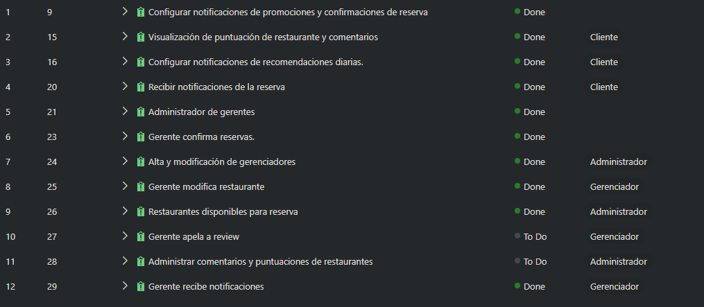

- Planificación de acuerdo a la capacidad del equipo.
- Técnicas de priorización y estimación utilizadas.
- Uso de métricas relevantes para la planificación como la velocidad y productividad.

## Seguimiento de la iteración

### Sprint planning
Se realizó una reunión en Discord para planificar la iteración 3. Se definieron las tareas a realizar en la iteración, cada integrante
eligio una tarea por la cual comenzar. En esta iteración se realizarán aproximadamente la mitad de las historias de usuario
medidas en puntos de historia que quedaron de la iteración anterior.

### Objetivos de la iteración

El objetivo de la iteración 3 es terminar en la construcción de la aplicación, implementando las historias de usuario que quedaron en la iteración anterior.
Se espera que al final de la iteración el cliente pueda tener un prototipo funcional de la aplicación, con las funcionalidades principales implementadas.
Iniciar sesión, registrar restaurantes y crear reservas (Iteración 2).
Gestión de reseñas, configuración de notificaciones, administración de gerentes y algunas caracterísitcas adicionales. (Iteración 3)

#### Planificación de acuerdo a la capacidad del equipo

Trabajaremos con la modalidad impulsada por el [TODO], [TODO]-driven, teniendo en cuenta la velocidad del equipo en la iteración anterior, 24.
En esta iteración decidimos trabajar en 12 historias de usuario que suman 23 puntos de historia.

#### Técnicas de priorización y estimación utilizadas

Para priorizar las historias de usuario las clasificamos en 3 categorías:
- Alta prioridad
- Media prioridad
- Baja prioridad

En azure las historias con prioridad alta equivalen a un 3, las de media a un 2 y las de baja a un 1.

#### Uso de métricas relevantes para la planificación como la velocidad y productividad

La velocidad del equipo que planificamos para esta iteración es de 23 puntos de historia.
La velocidad real al final de la iteración fue de 23 puntos de historia.

### Sprint backlog con historias de usuarios y tareas asociadas

El sprint backlog para la iteración 3 es el siguiente:
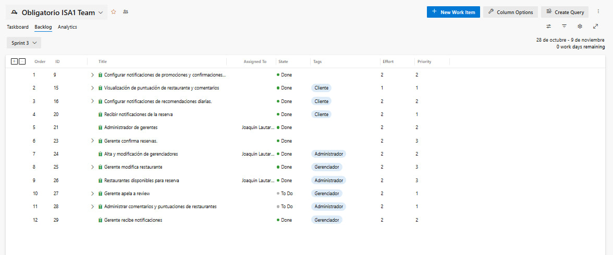

Se definieron las tareas a realizar:

### Artefactos principales

- Minuta de daily scrum describiendo la coordinación del trabajo de cada integrante del equipo.
  - ¿Qué logramos hacer?
  - ¿Qué planificamos hacer?
  - ¿Qué impedimentos tenemos?
- Registro y reporte de horas de cada integrante del equipo con sus actividades principales.
- Seguimiento visual de la iteración con burndown y/o burnup charts.

## Inspección y adaptación del proceso

### Seguimiento visual de la iteración con burndown y/o burnup charts
El burndown chart al mediodía del último día es el siguiente:
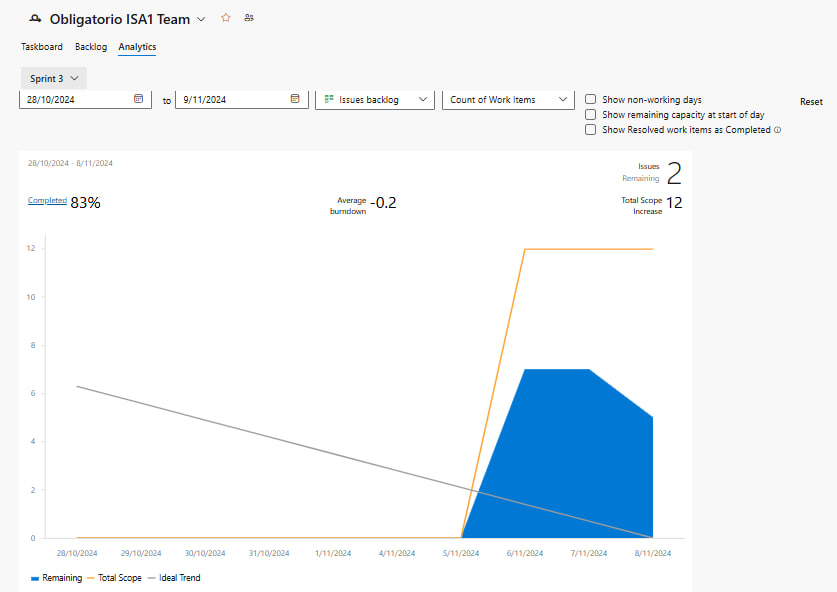

El burndown chart al final de la iteración 3 es el siguiente:
[TODO]

### Registro y reporte de horas de cada integrante del equipo con sus actividades principales.

Arza
- 

Salaberry
- 

Struyas
- 
_[Existe evidencia sobre la inspección del proceso con aprendizajes principales y acciones de mejora implementadas durante el desarrollo del proyecto.]_

### Artefactos principales

- Minuta de la retrospectiva con la dinámica utilizada y sus principales resultados.
- Planificación y seguimiento de las acciones de mejora.

# Construir y validar posibles soluciones del MVP a través de prototipos

## Prototipos con posibles soluciones

_[Existen diferentes propuestas de solución para entregar valor y resolver el problema identificado implementado a través de prototipos. Los prototipos deberán ser exportados en algún formato de imagen (como png o jpg) a efectos de poder ser visualizados fácilmente dentro del propio repo de github.]_

### Artefactos principales

#### Prototipos interactivos para ser navegados
- [Prototipo perfil administrador](https://www.figma.com/proto/BYvhnvacIuyWrmaI2aCwkn/Obligatorio-ISA?node-id=321-1029&node-type=canvas&t=Zf440yrWScs6Hac8-1&scaling=min-zoom&content-scaling=fixed&page-id=287%3A2605&starting-point-node-id=287%3A2646)

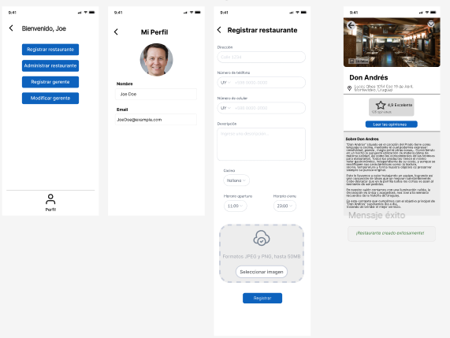
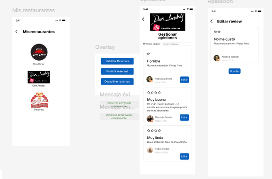
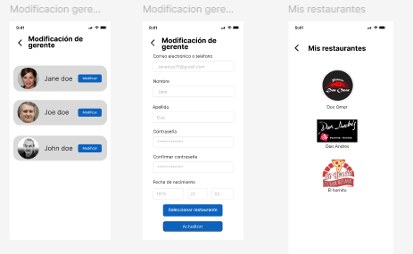
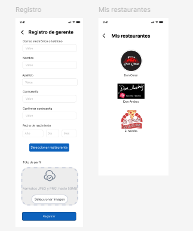

- [Prototipo perfil cliente](https://www.figma.com/proto/BYvhnvacIuyWrmaI2aCwkn/Obligatorio-ISA?node-id=165-1170&node-type=canvas&t=4706DZGmePyfHITl-1&scaling=scale-down&content-scaling=fixed&page-id=5%3A4&starting-point-node-id=165%3A1170)

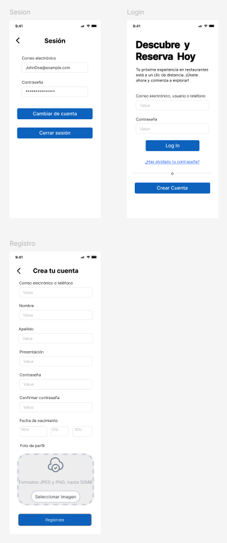
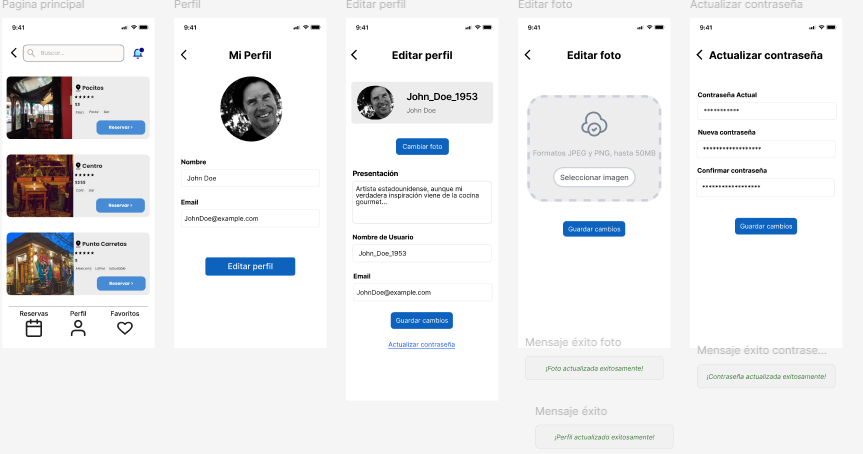
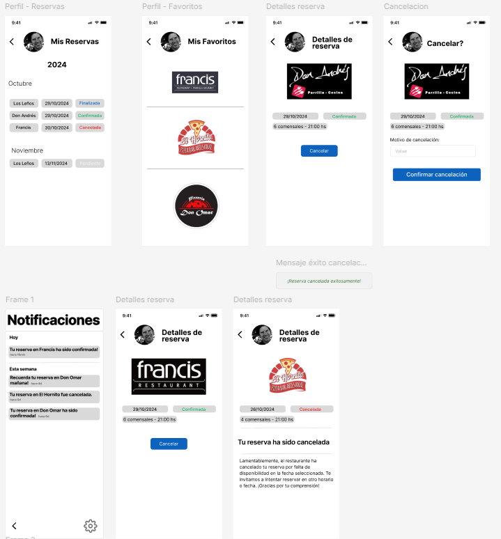
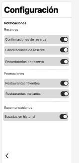

- [Prototipo perfil gerente](https://www.figma.com/proto/BYvhnvacIuyWrmaI2aCwkn/Obligatorio-ISA?node-id=136-1002&node-type=canvas&t=PX9Tm9qnh0T4Hlfn-1&scaling=min-zoom&content-scaling=fixed&page-id=136%3A897&starting-point-node-id=136%3A1002)

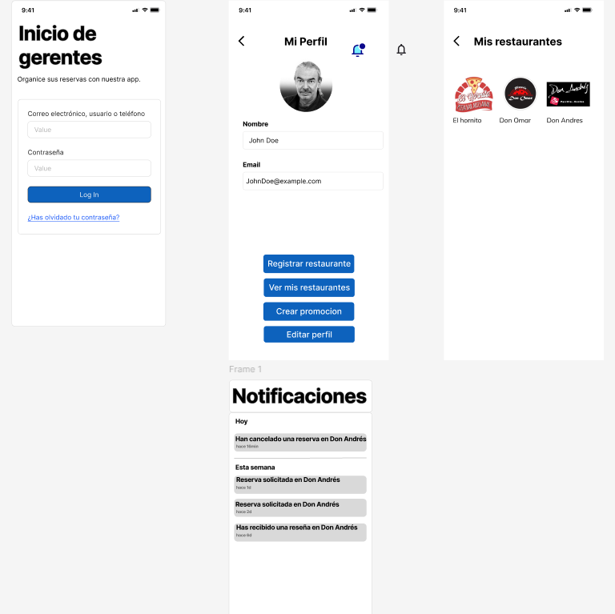
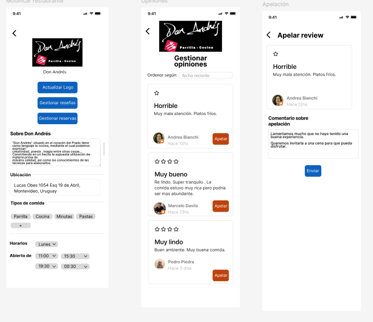
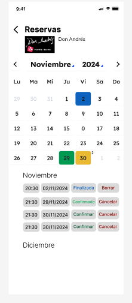

## Inspección y adaptación del producto

_[Existe evidencia de instancias de inspección y validación del producto con usuarios y la recolección de su feedback con ajustes finales a los prototipos.]_

### Artefactos principales

- Minutas de sprint review.
- Evidencia de los usability testing con usuarios finales.
  - Descripción de las tareas propuestas a los usuarios finales.
  - Cobertura obtenida de validación de los usuarios de la aplicación.
- Feedback recibido de los usuarios finales con la priorización de las propuestas de cambio.

### links (luego lo muevo a donde va)
