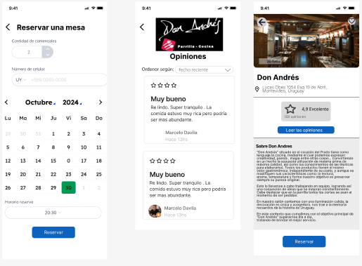
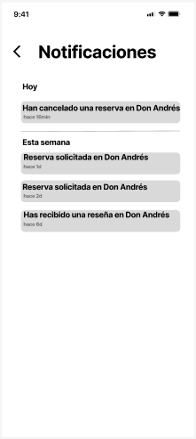

# Indice

- [Gestión de la iteración](#gestión-de-la-iteración)
  - [Definición del marco de trabajo](#definición-del-marco-de-trabajo)
  - [Planificación de la iteración](#planificación-de-la-iteración)
  - [Seguimiento de la iteración](#seguimiento-de-la-iteración)
  - [Inspección y adaptación del proceso](#inspección-y-adaptación-del-proceso)
- [Construir y validar posibles soluciones del MVP a través de prototipos.](#construir-y-validar-posibles-soluciones-del-mvp-a-través-de-prototipos)
  - [Prototipos finales](#prototipos-finales)

# Informe académico

## Descripción del proyecto

El proyecto consiste en desarrollar una aplicación móvil para que restaurantes puedan gestionar sus reservas.
Los clientes podrán ver las recomendaciones de restaurantes cerca de su ubicación, ver sus reseñas y evaluar, tipos de comida, ver disponibilidad y realizar reservas.
Los gerentes de restaurantes podrán gestionar las reservas y las mesas disponibles.

## Resumen de los resultados

Se completaron todas las funcionalidades prioritarias para los perfiles de cliente, gerente y administrador, destacando:
- Login, registro y edición de usuarios.
- Creación y cancelación de reservas.
- Gestión de notificaciones y restaurantes.
- Configuración de promociones y respuesta a comentarios para gerentes.

#### Prototipos en Figma:
Se desarrollaron prototipos interactivos que simulan flujos clave de la aplicación, desde el registro hasta la reserva y gestión de restaurantes. Estos prototipos fueron revisados y validados con usuarios finales, identificando oportunidades de mejora en la estética y usabilidad.

#### Validación y ajustes:
Las pruebas de usabilidad destacaron la claridad en la navegación, pero también identificaron áreas para optimizar, como:
- Hacer la interfaz más moderna y atractiva.
- Implementar filtros avanzados en la búsqueda de restaurantes.
- Mejorar los mensajes de confirmación visual y la gestión de notificaciones.

#### Resultados finales:
Cumplimos con los objetivos de cada iteración, logrando una velocidad promedio de 24 puntos de historia por sprint.
Se establecieron bases sólidas para continuar con el desarrollo del producto, priorizando funcionalidades como un sistema de recompensas y personalización avanzada.

## Reflexiones sobre las prácticas de ingeniería de software ágil
Utilizamos el marco de trabajo SCRUM para desarrollar el prototipo de una aplicación de restaurantes, siguiendo roles, eventos y artefactos definidos.

#### Adaptación de roles y eventos:
Los roles de Product Owner, Scrum Master y Development Team estuvieron bien definidos, con responsabilidades claras que facilitaron la organización y ejecución de tareas.
Las ceremonias SCRUM fueron adecuadas para el ritmo y complejidad del proyecto. Las reuniones se realizaron algunas presencialmente y otras mediante Discord, lo que permitió flexibilidad y una buena colaboración del equipo.

#### Gestión del trabajo y uso de herramientas:
Azure DevOps fue esencial para el seguimiento del progreso, principalmente el uso del product backlog y el sprint backlog y también las burndown charts que permitieron una visualización clara del desempeño en cada iteración.
La priorización mediante puntos de historia y categorías ayudó a enfocar los esfuerzos en las tareas mas importantes.

#### Retrospectiva:
Las retrospectivas proporcionaron un espacio valioso para reflexionar sobre el proceso y aplicar ajustes. Por ejemplo, se identificaron problemas de coordinación en el uso de Figma, lo que impulsó una revisión para evitar duplicidades en los prototipos.

#### Incorporación de feedback del usuario:
Los comentarios de usuarios finales fueron incorporados para ajustar la interfaz y las funcionalidades del prototipo, alineándolo mejor con las expectativas de los usuarios.

# Gestión de la iteración

## Definición del marco de trabajo

### Artefactos principales
**Eventos SCRUM**
- **Sprint Planning:** Se realizaron de manera presencial en la facultad o en discord, donde se definieron los objetivos del sprint y las tareas más prioritarias y sus story points.
- **Daily Scrum:** Se llevaron a cabo principalmente de manera presencial en la facultad, por WhatsApp o Discord. No fue necesario realizar daily meetings todos los días, y en algunos casos se implementaron mediante breves llamadas a través de Discord.
- **Sprint Review:** Se realizó al final de cada sprint para presentar el incremento del producto a los interesados clave.
- **Sprint Retrospective:** Esta ceremonia se llevó a cabo al final de cada sprint para discutir mejoras en los procesos y reflexionar sobre lo que funcionó y lo que puede optimizarse en los siguientes sprints.

#### Justificación de las adaptaciones principales del marco de trabajo al contexto del proyecto
Adaptamos la frecuencia de las daily scrums a la necesidad del equipo, realizándolas solo cuando era necesario.
A veces se realizaban en la facultad, otras veces por WhatsApp o Discord.

#### Definición del calendario de eventos con justificación de su adaptación al contexto de la iteración.
Seguimos el calendario planteado originalmente, respetando las fechas finales de las iteraciones y las ceremonias SCRUM.

#### Roles y responsabilidades definidos para cada integrante del equipo.
**Roles y responsabilidades del equipo**
- **Product Owner:** Magdalena Arza
  - Prioriza el Product Backlog y asegura que el equipo trabaje en las historias de mayor valor para el proyecto.
- **SCRUM Master:** Martín Salaberry
  - Facilita las ceremonias SCRUM, elimina obstáculos y asegura que se respeten las buenas prácticas del marco.
- **Development Team:** Joaquín Struyas, Martin Salaberry, Magdalena Arza
  - Encargados de desarrollar las historias de usuario planificadas en cada sprint, garantizando que el incremento del producto esté listo al finalizar la iteración.

## Políticas de trabajo del equipo:
### Definition of Done.
1. La historia cumple con todos los criterios de aceptación definidos al inicio.
2. El diseño visual y de interacción ha sido completado en Figma, con todos los elementos y componentes alineados a las guidelines establecidas.
3. La historia ha sido integrada en el prototipo de Figma de manera que el flujo se pueda navegar de forma intuitiva y sin errores.
4. El Product Owner ha revisado y aprobado el diseño final en Figma.

### Definition of Ready.
1. La historia cuenta con especificaciones visuales y de diseño claras, incluyendo cualquier guideline de estilo.
2. Cada historia tiene criterios de aceptación específicos que describen cómo debe funcionar y visualizarse el componente o flujo en Figma.
3. El Product Owner priorizó la historia como esencial para el sprint actual.

## Planificación de la iteración

#### Minuta de la sprint planning con su agenda, actividades y resultados.
Como resultado del sprint planning obtuvimos los objetivos de la iteración. 

#### Objetivos de la iteración
Para esta iteración, la última del release, se planificó realizar el informe y la presentación final del proyecto. 

- Como el objetivo de la iteración es realizar el informe y la presentación final del proyecto, no se planificaron historias de usuario ni tareas asociadas.
Por lo tanto, no planificamos en base a la capacidad del equipo ni utilizamos el backlog.

## Seguimiento de la iteración

### Minuta de daily scrum describiendo la coordinación del trabajo de cada integrante del equipo.
Fecha: 21/11/2024
Hora: 15:00

#### Organización para la grabación del video:
**Magdalena Arza:** Explicará las funcionalidades relacionadas con el gerente y realizará la edición de los videos.
**Martín Salaberry:** Presentará las características del perfil del cliente.
**Joaquín Struyas:** Explicará las funcionalidades del perfil del administrador, como la creación de restaurantes y registro de gerentes.

#### Errores y partes faltantes del prototipo:
Revisando el prototipo en la reunión, vimos que había errores en la interfaz, como problemas de flujo o errores de visualización, por lo que nos dividimos los prototipos para corregir estos problemas. Más específicamente, Martín se encargó del prototipo del cliente, Magdalena del gerente y Joaquín del administrador.

La reunión duró aproximadamente 30 minutos

### Registro y reporte de horas de cada integrante del equipo con sus actividades principales.

### Iteración 1
**Equipo** 
- Historias de usuario y sprint backlog: 2 horas 
- Sprint retrospective: 15 min

**Arza**
- Estudio de competidores: 1 hora 

**Arza y Struyas** 
- Story Map: 30 min 

**Salaberry** 
- Epicas: 1 hora

### Iteración 2
**Arza**
- 22/10 : 1 hora
- 24/10 : 3 horas

**Salaberry**
- 22/10 : 1 hora
- 23/10 : 3 horas

**Struyas**
- 22/10 : 1 hora
- 23/10 : 2 horas
- 24/10 : 1 hora

### Iteración 3
**Arza**
- Historias de usuario del gerente 2 horas
- Documentación 2 horas

**Salaberry**
- Historias de usuario del cliente 3 horas

**Struyas**
- Historias de usuario del administrador 3 horas
- Documentación 1 hora

### Iteración 4
  **Arza**
- Video presentación 2 horas
- Documentación 1 hora

**Salaberry**
- Video presentación 2 horas
- Documentacion 1 hora

**Struyas**
- Video presentación 2 horas
- Documentación 1 hora

#### Seguimiento visual de la iteración con burndown y/o burnup charts
No hay seguimiento ya que no definimos tareas ni historias de usuario, tampoco usamos el backlog.

## Inspección y adaptación del proceso

Durante cada iteración, se realizó una revisión del proceso mediante las retrospectivas para identificar áreas de mejora. Por ejemplo:

- Evaluar el progreso usando burndown charts y el cumplimiento de los objetivos de las iteraciones.
- Reflexionar sobre la efectividad de las herramientas utilizadas, como Figma y Azure DevOps.
- Revisar el cumplimiento de la Definition of Done para las historias de usuario completadas.

#### Aprendizajes principales
La flexibilidad en la frecuencia de las Daily Scrums permitió un uso más eficiente del tiempo, es decir no las realizamos diariamente sino cuando creiamos que era necesario organizarnos correctamente.
El uso combinado de Azure DevOps y Figma mejoró la colaboración, pero la falta de revisión temprana causó duplicidades en los prototipos como hablamos en iteraciones anteriores.
Integrar feedback de los usuarios al final de cada iteración ayudó a mejorar el producto.

#### Acciones de mejora implementadas
- Implementar un paso adicional de revisión para los prototipos en equipo, previo al Sprint Review.
- Usar etiquetas en Azure DevOps para categorizar tareas según prioridad y estado.

## Minuta de la retrospectiva con la dinámica utilizada y sus principales resultados.
Llevamos a cabo una reunión en Discord para reflexionar sobre las prácticas de ingeniería de software ágil aplicadas en el proyecto. Durante la llamada, discutimos y puntuamos los principales beneficios observados, así como las áreas que requerían ajustes. La reflexión la complementamos con el material teórico del curso, lo que permitió analizar nuestras prácticas desde una perspectiva más completa.

## Planificación y seguimiento de las acciones de mejora.
En esta iteración no tuvimos complicaciones debido a que principalmente su caracter es reflectivo, por lo que no fue necesario realizar acciones de mejora.

# Construir y validar posibles soluciones del MVP a través de prototipos

## Prototipos finales

Las imagenes del prototipo son las mismas que la de la iteración 3 a excepcion de unas nuevas páginas en el cliente y un arreglo en las notificaciones debido a un error de consistencia con el resto de la aplicación.
[Imagenes de la documentación de la Iteración 3](../iteración-3/README.md#título-en-archivo2)

## Prototipos interactivos finales con el feedback de las validaciones.
[Prototipo perfil administrador](https://www.figma.com/proto/BYvhnvacIuyWrmaI2aCwkn/Obligatorio-ISA?node-id=287-2646&node-type=canvas&t=IEOOjdqoqMzFfxcY-1&scaling=scale-down&content-scaling=fixed&page-id=287%3A2605&starting-point-node-id=287%3A2646)
[Prototipo perfil cliente](https://www.figma.com/proto/BYvhnvacIuyWrmaI2aCwkn/Obligatorio-ISA?node-id=165-1170&node-type=canvas&t=ZMpFgfFfSGATHKbQ-1&scaling=scale-down&content-scaling=fixed&page-id=5%3A4&starting-point-node-id=165%3A1170&show-proto-sidebar=1)
[Prototipo perfil gerente](https://www.figma.com/proto/BYvhnvacIuyWrmaI2aCwkn/Obligatorio-ISA?node-id=494-2010&node-type=canvas&t=jsyroM8cRIr85dXH-1&scaling=scale-down&content-scaling=fixed&page-id=136%3A897&starting-point-node-id=494%3A2010)

## Prototipos asociados como bocetos a las historias de usuario. [TODO]

## Lista de mejoras sugeridas de las validaciones con usuarios finales

### Mejoras implementadas en los prototipos

1. Confirmacion de acciones:
- Se añadieron mensajes visuales en los prototipos para confirmar acciones clave, como “Reserva confirmada” y “Añadido a favoritos”.
2. Filtros de busqueda:
- Se implementaron filtros básicos como tipo de cocina y rango de precios en el prototipo de la interfaz de búsqueda de restaurantes.
3. Gestion de notificaciones:
- En el prototipo se incluyó una sección para que los usuarios puedan habilitar o deshabilitar notificaciones específicas, como promociones o confirmaciones de reservas.
4. Diseño y estética:
- Se ajustaron los colores, el espaciado y la tipografía para modernizar la apariencia visual del prototipo.
5. Historial y Favoritos Organizados:
- Los prototipos muestran el historial de reservas y los restaurantes favoritos en pestañas separadas, mejorando la organización de la información.

### Mejoras fuera del alcance del proyecto

1. Avatares personalizados:
- Aunque se ampliaron las opciones de selección de avatares, la integración con redes sociales para personalización no se incluyó debido a restricciones de tiempo y alcance.
2. Tutoriales
- No se implementaron tutoriales interactivos, aunque se considera la posibilidad de incluirlos en fases futuras del proyecto.
3. Personalización avanzada:
- La opción de personalizar colores y temas no fue desarrollada en los prototipos actuales, ya que fue considerada como de menor prioridad.
4. Mapas Interactivos Mejorados:
- Aunque se incluyó la funcionalidad de ver la ubicación de los restaurantes en un mapa, no se implementaron filtros avanzados ni rutas de navegación.

